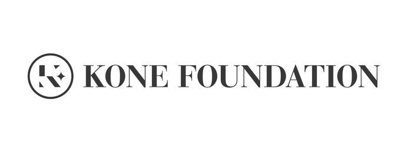

## Language Documentation meets Language Technology:

### The Next Step in the Description of Komi

 

The project aims to make a significant contribution to the description of Komi-Zyrian by 1) producing a full-fledged grammar parser building on previous work in the framework of Finite State Transducer Technology for morphological analysis and enriched with Constraint Grammar rules for syntactic disambiguation, and 2) creating a descriptive syntax of Komi written from a typological perspective and based on both our own corpus (created as a result of the project “Building an annotated digital corpus for future research on Komi speech communities in northernmost Russia”, which Kone Foundation recently funded) as well as the large corpus of literary Komi created in the Komi Republic, and annotated with the help of the above-mentioned parser. 

We will be one of the very first projects working in the paradigm of endangered language documentation while systematically applying methods from natural language processing for automated corpus annotation. This is against the mainstream, which prefers manual or semi-manual work. The two component parts of our project will also further best practices with regard to open data and reproducibility in linguistic research. 

The project team consists of Rogier Blokland, Michael Rießler and Niko Partanen. The work is funded by [Kone Foundation](http://www.koneensaatio.fi), and it is continuation to the work done in Izhva Komi Documentation Project during 2014-2016. The results of the last project can be seen, for example, on [videocorpora.ru](http://videocorpora.ru) website.

